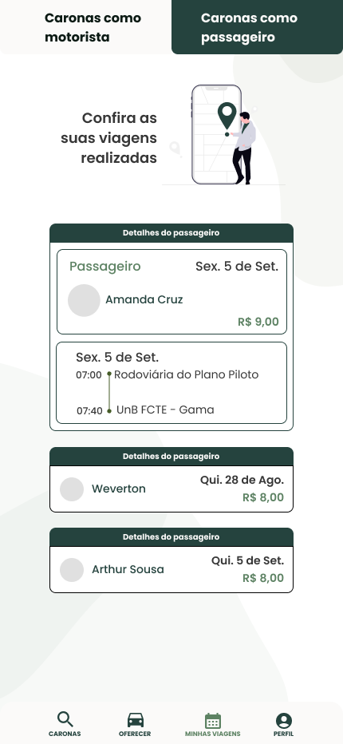

# 1.1. Design Sprint

---

## 1.1.1. Introdução

A **Design Sprint** é uma metodologia ágil de cinco dias desenvolvida pela [**Google Ventures**](https://www.gv.com/sprint/) para responder a questões críticas de negócios por meio de design, prototipagem e testes com clientes reais.

Ela é uma espécie de “compilado das melhores práticas” de várias áreas — estratégia de **negócios**, **inovação**, **ciência do comportamento** e ***design thinking*** — reunidas em um processo prático e testado que qualquer equipe pode aplicar.

## 1.1.2. Metodologia

O processo é dividido entre as seguintes fases:

- **Dia 1 -** ***Map:*** O time se reúne e as ideias, informações e pesquisas a respeito do produto são compartilhadas. Essa etapa é responsável por alinhar os conhecimentos e a equipe.
- **Dia 2 -** ***Sketch:*** Cada participante, de forma individual, gera ideias e realiza esboços de possíveis soluções a respeito do desafio.
- **Dia 3 -** ***Decide:*** A equipe analisa os esboços, vota e escolhe a melhor opção. Com isso, ocorre a criação de um *storyboard* que guiará o protótipo.
- **Dia 4 -** ***Prototype:*** O objetivo aqui é criar um protótipo rápido, mas realista o suficiente para poder ser testado.
- **Dia 5 -** ***Test:*** Usuários reais testam o protótipo com o propósito de validar, coletar feedback e identificar melhorias.  

Entretanto, fizemos uma breve **adaptação** do modelo, seguindo orientações da professora. A metodologia adaptada pode ser introduzida pela Figura 1, e melhor detalhada ao decorrer do artefato.

<figure markdown style="width: 60%">

<b>Figura 1:</b> Adaptação do Design Sprint

<b>Fonte:</b> SERRANO, Milene

</figure markdown>

## 1.1.3. Etapa 1 - Unpack (Dia 1)

Nesse primeiro momento, fizemos uma reunião remota através da plataforma [Teams](https://teams.microsoft.com/v2/), que durou cerca de 35 minutos. Durante a mesma, introduzimos o problema inicial, que seria a dificuldade de locomoção de muitos alunos até Faculdade de Ciência e Tecnologias em Engenharia (*FCTE*), o Campus da UnB no Gama. Fizemos um ***brainstorming*** coletivo, em que todos os membros participaram ativamente, discutindo a respeito de funcionalidades, objetivos e alguns diferenciais que nosso aplicativo teria. Com isso, já tínhamos em mente o nosso foco do projeto, porém ainda precisávamos registrar o nosso mapeamento para prosseguir para a próxima etapa. Por fim, após a reunião, optamos por criar um template no [Miro](https://miro.com/), que foi preenchido com base em toda a troca de ideias feita pela equipe, deixando claro os pontos críticos.

- [Link para a ata da reunião](Base/Atas/1.5.1.Atas.md)
- [Link para o quadro no Miro](https://miro.com/app/board/uXjVJNMKeBY=/?share_link_id=168867811961) 

<iframe width="768" height="432" src="https://miro.com/app/live-embed/uXjVJNMKeBY=/?embedMode=view_only_without_ui&moveToViewport=-103566,-18636,289458,86871&embedId=750525007314" frameborder="0" scrolling="no" allow="fullscreen; clipboard-read; clipboard-write" allowfullscreen></iframe>

A Tabela 1 apresenta a colaboração de cada integrante, evidenciando a participação de todos os membros durante a execução da Etapa 1.

<b>Tabela 1:</b> Quadro de colaboração do time na Etapa 1

| **Aluno**                           | **Participação**                                                  |
|-------------------------------------|-------------------------------------------------------------------|
| Amanda Cruz Lima                    | Contribuiu com insights importantes para a construção do projeto. |
| Arthur da Silveira Sousa            | Contribuiu com insights importantes para a construção do projeto. |
| Cauã Araujo dos Santos              | Contribuiu com insights importantes para a construção do projeto. |
| Caio Venâncio do Rosário            | Contribuiu com insights importantes para a construção do projeto. |
| Kaleb de Souza Macedo               | Contribuiu com insights importantes para a construção do projeto. |
| Lucas Monteiro Freitas              | Contribuiu com insights importantes para a construção do projeto. |
| Maria Eduarda de Amorim Galdino     | Contribuiu com insights importantes para a construção do projeto. |
| Othavio Araujo Bolzan               | Contribuiu com insights importantes para a construção do projeto. |
| Pedro Henrique dos Santos Ferreira  | Contribuiu com insights importantes para a construção do projeto. |

<b>Fonte:</b> Autoria de <a href="https://github.com/Tutzs"> Arthur da Silveira</a>

## 1.1.4. Etapa 2 - Sketch (Dia 2)

Na segunda etapa, tendo como base as ideias difundidas durante a primeira, cada membro ficou responsável por elaborar um **esboço do artefato generalista**. Durante a reunião presencial que ocorreu durante a aula, os membros executaram diversos artefatos, como Mapa Mental, Rich Picture, Diagrama de Ishikawa e 5W2H. Esses esboços contribuíram para representar de maneira mais clara a interação entre os usuários e fornecer uma visão de como a aplicação funcionaria. Além disso, conseguimos definir melhor o nosso escopo, por exemplo funcionalidades essenciais, público-alvo e riscos.

A Tabela 2, representada abaixo, descreve a participação de todos da equipe durante a Etapa 2.

<b>Tabela 2:</b> Quadro de colaboração do time na Etapa 2

| **Aluno**                           | **Participação**                          |
|-------------------------------------|-------------------------------------------|
| Amanda Cruz Lima                    | Elaboração do Mapa Mental.                |
| Arthur da Silveira Sousa            | Elaboração do Mapa Mental.                |
| Caio Melo Borges                    | Elaboração do Ishikawa.                   |
| Cauã Araujo dos Santos              | Elaboração de 5W2H.                       |
| Caio Venâncio do Rosário            | Elaboração do Rich Picture.               |
| Kaleb de Souza Macedo               | Elaboração de 5W2H.                       |
| Lucas Monteiro Freitas              | Elaboração de 5W2H.                       |
| Maria Eduarda de Amorim Galdino     | Elaboração do Mapa mental.                |
| Othavio Araujo Bolzan               | Elaboração do Rich Picture.               |
| Pedro Henrique dos Santos Ferreira  | Elaboração do Mapa mental.                |

<b>Fonte:</b> Autoria de <a href="https://github.com/Tutzs"> Arthur da Silveira</a>

## 1.1.5. Etapa 3 - Decide (Dia 3)

Com base nos resultados da Etapa 2, avançamos para a Etapa de **Decisão**, na qual revisamos os esboços individuais e, por meio de discussão estruturada, selecionamos os elementos mais relevantes de cada proposta. Essa etapa teve como foco identificar a solução mais promissora, entretanto, entramos em consenso que unificariámos cada um tipos de artefatos generalistas, por apresentarem informações essenciais e criativas. 

Em seguida, iniciamos a elaboração do *StoryBoard*, uma representação visual em formato de história em quadrinhos que ilustra, de forma simples e objetiva, a jornada do usuário. 

  
<strong> StoryBoard - Motorista</strong>

  

 <b>Fonte: </b> Autoria de Amanda, Arthur e Cauã</a>

  

  

  
<strong> StoryBoard - Passageiro</strong>

  

 <b>Fonte: </b> Autoria de Amanda, Arthur e Cauã</a>

  

Nesse sentido, a compreensão do fluxo de uso do sistema foi facilitada e serviu de apoio para a construção do protótipo. A Etapa 3 ocorreu de forma remota, com enquetes e uso do quadro criado anteriormente no Miro, todos participaram e possuem suas devidas atividades registradas abaixo, na Tabela 3.

- [Link para o documento de Artefato Generalista](Base/1.2.ArtefatoGeneralista.md)

<b>Tabela 3:</b> Quadro de colaboração do time na Etapa 3

| **Aluno**                           | **Participação**                                 |
|-------------------------------------|--------------------------------------------------|
| Amanda Cruz Lima                    | Participou ativamente com a discussão e construção do *StoryBoard*. |
| Arthur da Silveira Sousa            | Participou ativamente com a discussão e construção do *StoryBoard*. |
| Caio Melo Borges                    | Participou ativamente com a discussão e refinou o Diagrama de Ishikawa.|
| Cauã Araujo dos Santos              | Participou ativamente com a discussão e construção do *StoryBoard*. |
| Caio Venâncio do Rosário            | Participou ativamente com a discussão e refinou o Rich Picture.  |
| Kaleb de Souza Macedo               | Participou ativamente com a discussão e complementou o 5W2H.     |
| Lucas Monteiro Freitas              | Participou ativamente com a discussão e complementou o 5W2H.     |
| Maria Eduarda de Amorim Galdino     | Participou ativamente com a discussão e ajudou no Mapa Mental.    |
| Othavio Araujo Bolzan               | Participou ativamente com a discussão e refinou o RichPicutre.   |
| Pedro Henrique dos Santos Ferreira  | Participou ativamente com a discussão e ajudou no Mapa Mental.    |

<b>Fonte:</b> Autoria de <a href="https://github.com/Tutzs"> Arthur da Silveira</a>

## 1.1.6. Etapa 4 - Prototype (Dia 4)

Iniciamos a fase de **Prototipação** após a etapa 3, com o auxílio dos artefatos generalistas e do *StoryBoard*. Em uma reunião simples feita na plataforma Discord, desenvolvemos um protótipo de média fidelidade, que serviu como base para estruturar as ideias iniciais, capaz de representar de forma mais fiel a solução proposta. Foram elaboradas as principais telas do aplicativo, evidenciando suas funcionalidades centrais e sempre considerando aspectos de acessibilidade e design, de modo a garantir uma experiência agradável e intuitiva para os usuários. 

- [Link para acessar o protótipo no Figma](https://www.figma.com/design/vrYPmL3YltoVs34tE3Xjeh/Prot%C3%B3tipo-CaronaAmiga?node-id=0-1&p=f&t=ueu0FQm1igD2wZlK-0)

<iframe style="border: 1px solid rgba(0, 0, 0, 0.1);" width="800" height="450" src="https://embed.figma.com/design/vrYPmL3YltoVs34tE3Xjeh/Prot%C3%B3tipo-CaronaAmiga?node-id=0-1&embed-host=share" allowfullscreen></iframe>

#### Descrição das telas:

- **Tela 1: Inicial - Usuário não logado**
    - ***Descrição:*** Tela inicial do aplicativo. Contém botões que levam para a área de login ou criação de conta.
    - ***Observações:*** Nenhuma por enquanto.

  
<strong>Protótipo: Tela inicial - Usuário não logado</strong>

  
  

 

- **Tela 2: Cadastro**
    - ***Descrição:*** Tela de cadastro do aplicativo. Contém um formulário com campos obrigatórios que são necessários para criar a conta.
    - ***Observações:*** Possibilidade de verificação de aluno real da FCTE e cadastrar como motorista ou passageiro, ou ambos. 

  
<strong>Protótipo: Tela de Cadastro</strong>

    
  

 

- **Tela 3: Login**
    - ***Descrição:*** Tela de login do aplicativo. Contém um formulário requerido para acessar as funcionalidades e uma opção de recuperar a senha, caso esquecida.
    - ***Observações:*** Nenhuma por enquanto.

  
<strong>Protótipo: Tela de Login</strong>

    
  

- **Tela 4: Principal | Encontrar caronas - Usuário Logado**
    - ***Descrição:*** Tela principal do aplicativo. Aqui o usuário poderá encontrar caronas preenchendo campos de local atual e o destino, sendo um deles obrigatoriamente a FCTE, data e horário. Além disso, as caronas disponíveis e suas informações serão exibidas ao preencher o formulário. Possui uma navbar para navegar entre as funcionalidades.
    - ***Observações:*** Nenhuma por enquanto.

  
<strong>Protótipo: Tela principal e encontrar caronas</strong>

    
  

- **Tela 4.1: Modal de Confirmação | Confirmar pedido de caronas - Usuário Logado**
    - ***Descrição:*** Sobreposição que aparece ao selecionar uma opção da lista. No topo, a avaliação do motorista (estrelas e nota). Em seguida, um cartão com nome do motorista, modelo e vagas. O bloco de itinerário mostra data, hora de saída, ponto de origem e ponto de chegada, além do tempo estimado e preço final. O botão Confirmar conclui a reserva da vaga e direciona o usuário para o acompanhamento em Minhas viagens. O modal foca em confiança (nota/estrelas) e clareza do trajeto antes da decisão, reduzindo atrito na última etapa da escolha.
    - ***Observações:*** Nenhuma por enquanto.

  
<strong>Protótipo: Modal de Confirmar Carona</strong>

    
  

- **Tela 5: Oferecer caronas - Usuário com veículo cadastrado**
    - ***Descrição:*** Tela para motoristas publicarem uma viagem. Informe origem e destino (com opção de inverter rota), ajuste vagas e preço por assento nos botões +/−, selecione data e hora e marque serviços opcionais (Apenas mulheres, Ar-condicionado, Oferece paradas, Bagagem). Ao tocar Publicar, a oferta é validada (campos obrigatórios e data/hora futura) e fica visível na busca e em Minhas viagens; a navegação inferior mantém a consistência do app.
    - ***Observações:*** Nenhuma por enquanto.

  
<strong>Protótipo: Tela de Oferecer Caronas</strong>

    
  

- **Tela 6: Minhas Viagens (Caronas como motorista) - Usuário logado**
    - ***Descrição:*** Histórico do motorista. Mostra a viagem mais recente em Detalhes (veículo/vagas, duração, preço, avaliação e itinerário: data/horas, origem→destino) com Enviar mensagem; abaixo, cartões resumidos de viagens anteriores (nome, data, valor). Rodapé: Minhas viagens ativo.
    - ***Observações:*** Nenhuma por enquanto.

  
<strong>Protótipo: Tela de Caronas como Motorista</strong>

    
  

- **Tela 7: Minhas Viagens (Caronas como passageiro) - Usuário logado**
    - ***Descrição:*** Histórico do passageiro. Cartões Detalhes do passageiro trazem selo Passageiro, nome, valor e itinerário (data/horas, origem→destino); a lista inferior resume outros registros com nome, data e valor. Rodapé: Minhas viagens ativo.

  
<strong>Protótipo: Tela de Caronas como Passageiro</strong>

    
  

- **Tela 8: Tela de Perfil - Usuário logado**
    - ***Descrição:*** Tela de autenticação do usuário. Exibe a logo CaronaAmigaFCTE, botão de voltar no topo e o formulário com E-mail e Senha (campos obrigatórios, validação de formato do e-mail). O link “Esqueceu a senha? Recupere aqui” leva ao fluxo de recuperação. O botão Entrar envia as credenciais e, em caso de sucesso, direciona para Encontrar Caronas; erros aparecem como mensagem junto aos campos.
    - ***Observações:*** Nenhuma por enquanto.

  
<strong>Protótipo: Tela de Perfil</strong>

    
  

Na Etapa 4, nem todos os membros puderam participar devido a indisponibilidade de horário, porém contribuiram com *feedbacks* positivos.

<b>Tabela 4:</b> Quadro de colaboração do time na Etapa 4

| **Aluno**                           | **Participação**               |
|-------------------------------------|-----------------------------   |
| Amanda Cruz Lima                    | Ajudou na criação do protótipo.|
| Arthur da Silveira Sousa            | Ajudou na criação do protótipo.|
| Cauã Araujo dos Santos              | Ajudou na criação do protótipo.|

<b>Fonte:</b> Autoria de <a href="https://github.com/Tutzs"> Arthur da Silveira</a>

## 1.1.7. Etapa 5 - Validate (Dia 5)

Na última etapa da metodologia, **validamos o protótipo** desenvolvido na fase anterior. O nosso objetivo era verificar se as telas correspondiam ao propósito estabelecido durante o processo. Tendo isso em mente, elaboramos um formulário e, como nos encaixamos no perfil de usuário do projeto, respondemos com base em nossa experiência como usuários de aplicativos semelhantes ou o quê esperamos de um aplicativo como este.

As perguntas e união das respostas que usamos para verificar e validar estão descritas na Tabela 5 a seguir, assim como as participações na Tabela 6.

<b>Tabela 5:</b> Formulário de validação do protótipo

| **Pergunta**                                                             | **Resposta**                                                                                                                         |
|--------------------------------------------------------------------------|--------------------------------------------------------------------------------------------------------------------------------------|
| **1. A navegação é intuitiva?**                                         | Sim. O protótipo apresentou uma interface clara, com menus e botões de fácil acesso. Pequenos ajustes de design podem melhorar ainda mais. |
| **2. O processo de solicitar ou oferecer carona foi entendido sem ajuda?** | Sim. A função aparece em destaque na tela inicial, com fluxo simples de preenchimento (trajeto, horário, vagas etc.).                 |
| **3. Ficou claro que a plataforma busca facilitar o transporte entre alunos?** | Ficou claro. Mostra a conexão motorista-passageiro especificamente.         |
| **4. A proposta de “carona entre alunos da FCTE” está evidente?**                | Sim. O protótipo explicita diretamente a proposta nas áreas principais, como tela inicial ou apresentação.       |
|**5. Você consegue encontrar e reservar caronas facilmente?**                    | Sim. A listagem de caronas e os filtros de pesquisa tornam a visualização e seleção simples.                                          |
| **6. Como passageiro, você teria confiança em aceitar uma carona?**              | Parcialmente. Perfis e avaliações ajudam, mas é necessário reforçar a segurança (ex: verificação institucional).                      |
| **7. Sente falta de informações quanto ao motorista ou trajeto?**                | Não. Antes mesmo de escolher a carona já podemos ter informações sobre o motorista e a rota.                                       |
| **8. Como motorista, você se sentiria reconhecido ou valorizado?**               | Sim. Avaliações e feedback já contribuem, mas selos de bom condutor poderiam reforçar ainda mais a valorização.                      |

<b>Tabela 6:</b> Quadro de colaboração do time na Etapa 5

| **Aluno**                           | **Participação**               |
|-------------------------------------|-----------------------------   |
| Amanda Cruz Lima                    | Criou o formulário de validação e fez pesquisas para validar.|
| Arthur da Silveira Sousa            | Criou o formulário de validação e fez pesquisas para validar.|
| Cauã Araujo dos Santos              | Criou o formulário de validação e fez pesquisas para validar.|

<b>Fonte:</b> Autoria de <a href="https://github.com/Tutzs"> Arthur da Silveira</a>

## 1.1.8. Conclusão

A execução da Design Sprint permitiu à equipe compreender de forma mais clara o problema enfrentado pelos alunos da FCTE em relação à mobilidade, além de possibilitar a construção colaborativa de uma solução viável e inovadora. Ao longo das cinco etapas, conseguimos alinhar expectativas, compartilhar ideias, selecionar caminhos promissores e transformar conceitos em um protótipo funcional, capaz de transmitir de maneira concreta a proposta de valor do projeto Carona Amiga.

De maneira geral, a Design Sprint contribuiu para o amadurecimento da equipe quanto ao entendimento do problema, ao desenvolvimento de senso crítico sobre as escolhas realizadas e à valorização do processo iterativo de design. Como resultado, saímos não apenas com um protótipo inicial validado, mas também com uma base sólida para a continuidade do projeto, guiada pelo feedback obtido e pelo aprendizado coletivo.

## 1.1.9. Referências

> GOOGLE VENTURES. The Design Sprint — GV. Disponível em: <https://www.gv.com/sprint/>.

> KNAPP, J.; ZERATSKY, J. The Design Sprint. Disponível em: <https://www.thesprintbook.com/the-design-sprint>.

> SERRANO, Milene. Aula - PROJETO E DESENHO DE SOFTWARE. Material em Slide. Disponível em: <https://aprender3.unb.br/pluginfile.php/3178524/mod_page/content/5/Arquitetura%20e%20Desenho%20de%20software%20-%20Aula%20Projeto-DSW%20-%20Profa.%20Milene.pdf>

## Histórico de Versões

| Versão | Data       | Descrição                            | Autor                               | Revisor                                               |
| :----: | ---------- | ------------------------------------ | ------------------------------------| ----------------------------------------------------- |
| `1.0`  | 02/09/2025 | Criação do documento Design Sprint   |  [Arthur](https://github.com/Tutzs) | [Amanda Cruz](https://github.com/mandicrz)            | 
| `1.1`  | 03/09/2025 | Adição de informações adicionais e formatação do documento | [Amanda Cruz](https://github.com/mandicrz) | [Arthur](https://github.com/Tutzs) | 
| `1.2`  | 04/09/2025 | Adição de StoryBoard e correções | [Amanda Cruz](https://github.com/mandicrz) | [Arthur](https://github.com/Tutzs) | 
| `1.3`  | 04/09/2025 | Complementando com os detalhes de cada tela e suas imagens | [Cauã Araujo](https://github.com/caua08) | [Amanda Cruz](https://github.com/mandicrz) | 
